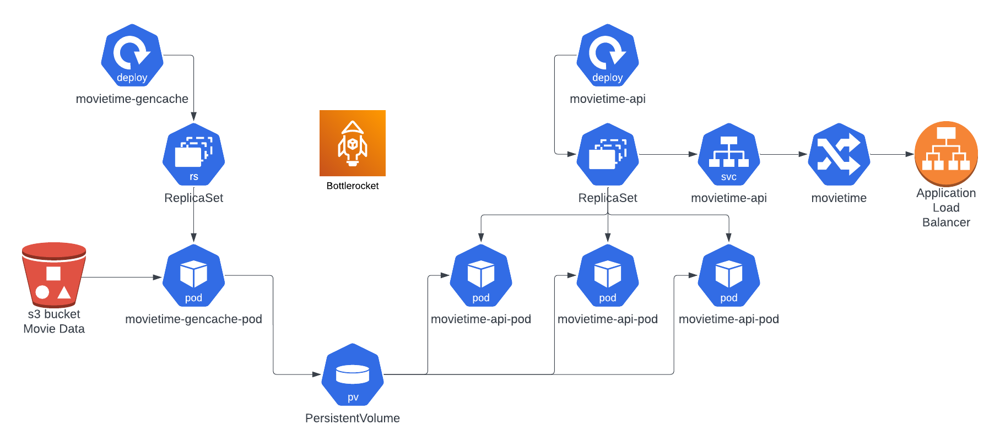

= JPMC Movietime API =

== Architecture ==

== API Docs ==

All Movies
 * GET `curl https://server/movies`

Search by movie title
 * GET `curl https://server/movies/titles/<Movie Title>`
 * GET `curl https://server/movies/titles/Dune`
 * GET `curl https://server/movies/titles/The%20Terminator`

Search by movie cast 
 * GET `curl https://server/movies/cast/<Movie Title>`
 * GET `curl https://server/movies/cast/Denzel%20Washington`

Search by movie genre 
 * GET `curl https://server/movies/genre/<Movie Genre>`
 * GET `curl https://server/movies/genre/Action`

Search by movie year 
 * GET `curl https://server/movies/year/<Movie Year>`
 * GET `curl https://server/movies/year/1900`
